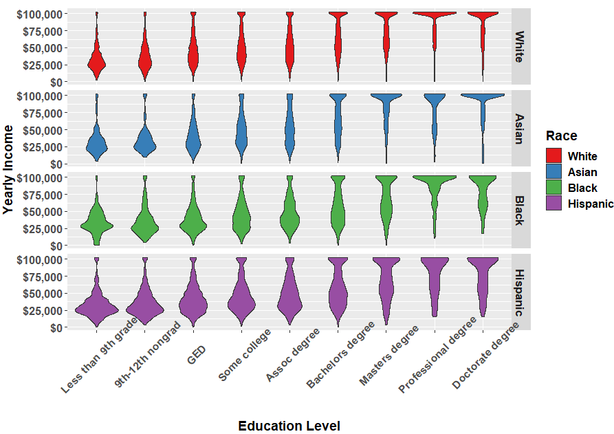

Race, Education Level, Income
================
Ted Braun
7/9/2021

## Background

We often (or at least I often) hear that minorities, especially African American and Hispanic 
people are paid less for the same work in the U.S.  This information depending on the context can be 
anecdotal with individual stories which can be individually quite moving.  
  
## Details    
With this as a backdrop/background I set out on a weekend morning in search of data to 
explore related to this subject.  As it turns out it did not take long to locate data relevant 
to the topic.  
  
After Googling around for a bit I found information from the U.S. Census Bureau Population Survey Data 
that they collect as part of the their Annual Social and Economic (ASEC) survey which provides estimates on 
income, poverty, and health insurance coverate in the U.S.
This information can be got to from here: <https://www.census.gov/programs-surveys/cps/data.html>  
  
From this point I quickly made my way to the Current Population Survey Tables for Personal Income 
which is a joint effort between the Bureau of Labor Statistics and the Census Bureau.  It is 
located here: <https://www.census.gov/data/tables/time-series/demo/income-poverty/cps-pinc.html>  
  
The data from this page which interested me (well at least at first/for this exercise, there is a lot 
of great data here - thank you U.S. Census Bureau and Bureau of Labor and Statistics!) was the table PINC-03: 
Personal Income:  Education Attainment-People 25 Years Old and Over, by Total Money Earnings, Work Experience, 
Age, Race, Hispanic Origin, and Sex.  It is located here:  <https://www.census.gov/data/tables/time-series/demo/income-poverty/cps-pinc/pinc-03.html>  
  
There is also a lot of detailed information broken down by sex (Male/Female) which I should get into as well, but 
for purposes of this quick analysis looked at race only.  
  
In looking at one of the files sub-section '25 to 64 Years', and then 'Worked Full-Time, Year-Round' for the different races available:  
- White  
- Black  
- Asian   
- Hispanic  
  
we can find that they are all Excel files formatted in the same manner, so... bingo, we have got some data we can automate in extracting 
directly from the [Internets](https://www.youtube.com/watch?v=j5uIlmI7PpY).  
Not sure why the U.S. Census Bureau saves the data in such an awesome manner (not), but hey, it is the same across the files, so we can 
automate grabbing it (I just would not want to be the poor sucker who is formatting every one of the files in Excel in the exact same format - 
my tax dollars not very efficiently at work... ...  :-/ ).  
  
So wrote and commented a program to do just this which can be seen here:  
  <https://github.com/TedBYanKei/Race_EducationLevel_Income/blob/main/Race_EducationLevel_Income.r>
  
As an outcome of the program the following `R ggplot` violin graph I found to be satisfactory way to view the information;  
  
  
  
But the information that the graph is telling us is not at all satisfactory.  In fact it is quite depressing.  Note how Black and Hispanic people have lower skewed incomes.  
  
What is more dispirting is that this disproportionately lower income for Blacks and Hispanic is across every educational level.  
Discrimination knows no income level, in fact look at the comparatively lower skewing for Blacks and Hispanics for those with Bachelors degrees and higher.  
  
We can only hope that the disparities here, as plainly laid out by U.S. Census Bureau and Bureau of Labor and Statistics are amerliorated over time.  

 
